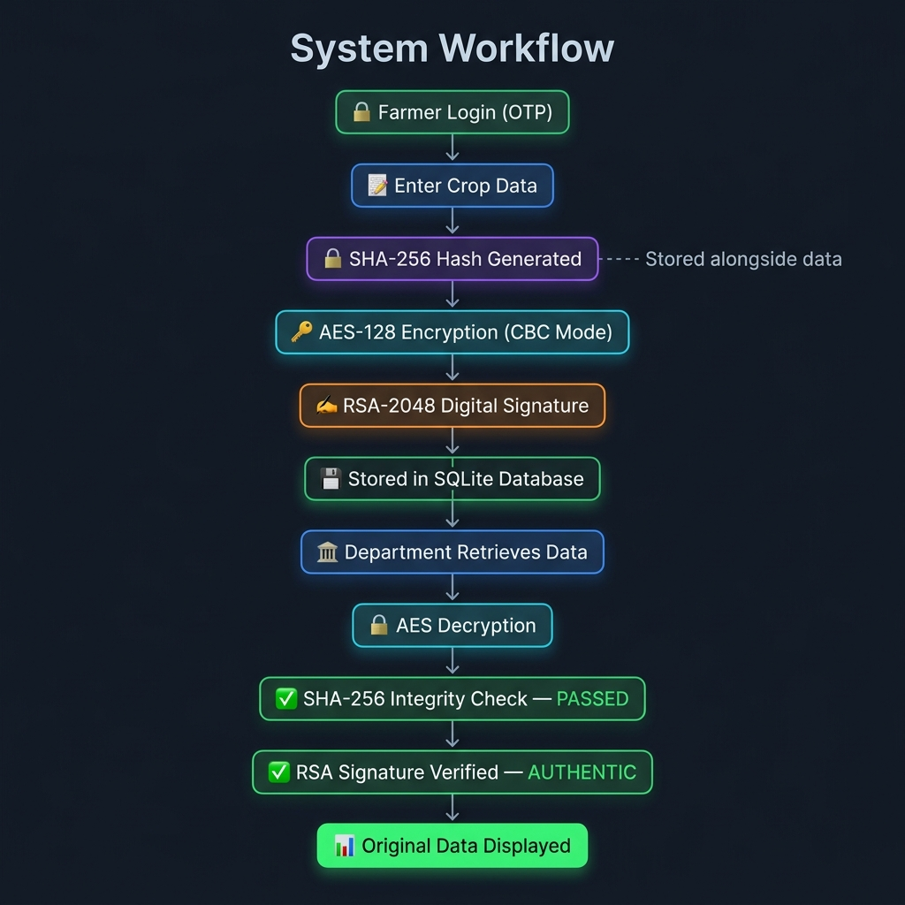
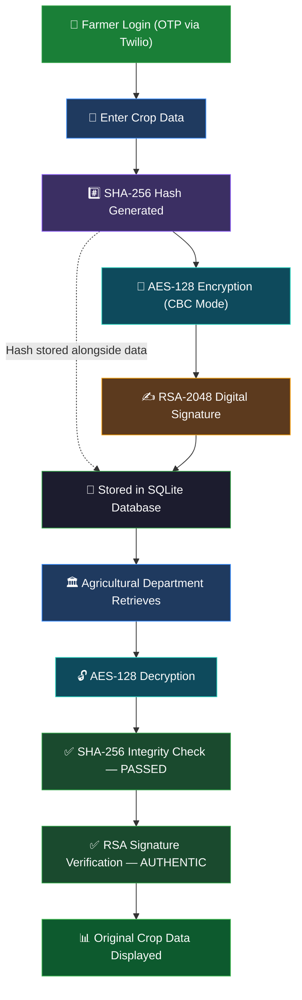

# 🌾 SecureCrop — Agricultural Data Security Portal

A full-stack cryptography project implementing **AES-128**, **SHA-256**, and **RSA-2048 Digital Signatures** for securing farmer crop data.

---

## 🔐 Cryptography Stack

| Algorithm | Purpose | Details |
|-----------|---------|---------|
| **AES-128** | Confidentiality | CBC mode, random 16-byte key per record |
| **SHA-256** | Integrity | Detects any data tampering |
| **RSA-2048** | Authentication | PKCS#1 v1.5 digital signature |

---

## 📁 Project Structure

```
secure_crop_portal/
├── app.py                         # Flask backend (all crypto logic)
├── requirements.txt               # Python dependencies
├── .env                           # Twilio API keys (not tracked)
├── crop_data.db                   # SQLite database (auto-created)
├── assets/
│   └── workflow.png               # System workflow diagram
├── templates/
│   ├── index.html                 # Landing page
│   ├── login.html                 # OTP authentication page
│   ├── farmer.html                # Farmer portal
│   ├── department.html            # Department portal
│   └── admin_login.html           # Admin login page
└── README.md
```

---

## 🚀 Setup & Run

### 1. Clone the repository
```bash
git clone https://github.com/Tirth18097/SecureCrop-Portal.git
cd SecureCrop-Portal
```

### 2. Install dependencies
```bash
pip install -r requirements.txt
```

### 3. Configure environment variables
Create a `.env` file in the root directory:
```env
TWILIO_ACCOUNT_SID=your_account_sid
TWILIO_AUTH_TOKEN=your_auth_token
TWILIO_VERIFY_SID=your_verify_sid
```

### 4. Run the Flask server
```bash
python app.py
```

### 5. Open in browser
```
http://localhost:5000
```

---

## 🔄 System Workflow

<p align="center">
  
</p>



---

## 📌 API Endpoints

| Method | Endpoint | Description |
|--------|----------|-------------|
| `POST` | `/api/send-otp` | Send OTP to phone via Twilio |
| `POST` | `/api/verify-otp` | Verify OTP and authenticate |
| `POST` | `/api/encrypt` | Encrypt & store crop data |
| `GET` | `/api/decrypt/<id>` | Decrypt & verify record |
| `GET` | `/api/records` | List all stored records |
| `DELETE` | `/api/records/<id>` | Delete a crop record |
| `POST` | `/api/admin-login` | Admin authentication |
| `GET` | `/api/me` | Get current user info |

---

## 🎓 Algorithm Details

### AES Encryption (app.py: `aes_encrypt`)
- Generates a fresh random 16-byte key per record
- CBC mode with random IV for semantic security
- Data is padded to AES block size (PKCS7)

### SHA-256 Hashing (app.py: `sha256_hash`)
- Hash computed on raw crop data before encryption
- Stored alongside encrypted data
- Re-computed on decryption and compared

### RSA Digital Signature (app.py: `sign_data`, `verify_signature`)
- 2048-bit RSA key pair generated per upload
- Private key signs SHA-256 hash of data
- Public key stored in DB for later verification
- PKCS#1 v1.5 scheme

---

## ✅ Three Goals of Cryptography Achieved

1. **Confidentiality** → AES encryption
2. **Integrity** → SHA-256 hashing
3. **Authentication** → RSA digital signatures
